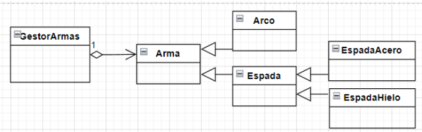

# Diseccionando un examen
El objetivo de esta práctica es **realizar paso a paso los diferentes ejercicios de un examen.**

 


Comprobaremos cómo dividiendo el problema en problemas más sencillos podemos resolverlo.

También iremos detectando **problemas que se pueden resolver por "imitación"** aplicando los conceptos aprendidos en clase en ejercicios similares.

Finalmente nos daremos cuenta que dichos ejercicios eran más fácil de solucionar de lo que en un principio nos pueda parecer.

Vamos a aprender estrategias para en un ambiente hostil, como es un examen, podamos salir victoriosos!!!!


## EJERCICIO 1: validando DNI

Debes completar el método ejecutaEjercicio1() de la clase Utilidades (paquete es.daw.examen2ev.util).
 
En él está declarada una cadena con DNIs para las pruebas.

Crea un método en la clase Utilidades para validar la letra de cada DNI. 

Dicho método:

- Se llamará validarDNI.
- Recibirá un String con el DNI.
- Devolverá un booleano para indicar que el DNI es válido.
- Propagará la excepción DniFormatException.

Lo primero que hay que hacer es comprobar que el formato del DNI sea correcto, es decir, que esté compuesto de 8 dígitos y acabado en una letra mayúsculas.

En el caso de que el formato sea correcto, para el cálculo de la letra válida del DNI se deberá utilizar el algoritmo del Ministerio de Interior. Para verificar el DNI  de españoles residentes mayores de edad se utiliza el siguiente algoritmo:

- Se divide el número del DNI entre 23.
- Con el resto de la división se obtiene la letra en base a lo especificado en la siguiente tabla:


En el caso de que el DNI sea incorrecto, ya sea por el formato o por la letra, deberá propagarse una excepción con el mensaje apropiado en cada caso:

```
"El DNI XXXXX no tiene una letra válida"
"El DNI XXXX no sigue el patrón [0-9]{8}[A-Z]{1}"
```

Para ello crea una excepción controlada llamada DniFormatException en el paquete es.daw.examen2ev.exception.

En el método ejecutaEjercicio1() haz la llamada al método con cada DNI y muestra un resultado por consola similar al siguiente:


## EJERCICIO 2: gestor de armas de Minecraft

Se proporciona el método ejecutaEjercicio2() de la clase Utilidades (paquete es.daw.examen2ev.util). Está completo. No debes modificar ni añadir nada!!!!

Revisa atentamente el código proporcionado!!!!

Siguiendo los pilares y principios de la POO, implementa el modelo de clases en el paquete es.daw.examen2ev.model en base a las siguientes especificaciones:



### Clase GestorArmas:

- Compuesto por una lista dinámica de armas.
- Una vez creado el gestor, no se podrá modificar dicha lista, salvo por los siguientes métodos:
    - **addArma:** para añadir armas a su lista. Recibirá como argumento el arma.
    - **removeLastArma:** para borrar la última arma de la lista.

### Clase Arma:

- Toda arma se caracteriza por:
    - nombre: cadena de texto.
    - damage: valor entero que indica el daño que causa.

- Para crear un arma es necesario especificar esas dos características.
- Una vez creada el arma, no se podrá modificar su nombre pero sí el daño que causa.
- Además ten en cuenta que es necesario llevar en cuenta el número de armas que se crean. Para ello es necesario controlar dicho contador en esta clase para poder consultarse en cualquier momento.

### Tipos de armas:

Habrá dos tipos de armas diferentes:

#### Espada:
- La espada se caracteriza además por si está afilada o no (afilada): valor booleano.
- Para crear una espada se necesita especificar todas sus características.
- Todas las espadas cortan, pero dependiendo del tipo de espada la forma de cortar es diferente. 
    - Acorde a las recomendaciones de POO, implementa el método cortar() teniendo en cuenta que dicho método solo muestra un mensaje por consola. 
    - Existen dos clases de Espada y el mensaje al cortar será:
        - En la clase **EspadaAcero:** “Soy de acero y corto si estoy afilada”.
        - En la clase **EspadaHielo:** “Soy de hielo y solo corto en invierno”;

#### Arco
- Esta arma se caracteriza además por la distancia de alcance (distancia): valor decimal (float).

Si has hecho todo en base a las especificaciones, los errores de código habrán desaparecido y al ejecutar el ejercicio, se mostrará lo siguiente por consola:


## EJERCICIO 3: Empleados POO

Debes completar el método ejecutaEjercicio3() de la clase Utilidades (paquete es.daw.examen2ev.util).

Se proporciona la clase AgenteDAO (paquete es.daw.examen2ev.model2) para poder obtener una lista de empleados y clientes.

Todos los agentes corporativos (empleados y clientes, roles diferentes y tienen relaciones distintas con la empresa) tienen en común que son “Corporatable”. Se proporciona dicha interface. Observa su método abstracto obtenerRazonSocial().

La razón social se obtiene de forma diferente:
- En el caso de los empleados, su razón social es una cadena de texto formada por los apellidos, nombre y DNI de la persona física. Por ejemplo: “Jobs, Steve 11111111C”
- En el caso de un cliente, la razón social es simplemente el nombre.

### Completa la clase Empleado y Cliente en base a las siguientes especificaciones:

La especificación de los atributos y constructores necesarios para la clase Cliente los obtienes directamente con la información de AgenteDAO. 

La especificación de los atributos y constructores necesarios para la clase Empleado los obtienes directamente con la información de AgenteDAO. 

En el caso de que al dar de alta un Empleado no se especifique el departamento al que pertenece, por defecto el departamento será DESARROLLO. Se proporciona la clase enumerada.

Se valora el uso de llamada entre métodos constructores.

Teniendo en cuenta que la ordenación natural de los empleados es ascendente por DNI, muestra solo la razón social de los empleados ordenados:


Por otro lado, muestra solo los Clientes con toda su información:


### Encontrar clientes

Para ello tienes que implementar un método en la clase Utilidades con la siguiente firma o declaración:

```
public static int existeCliente(ArrayList<Cliente> clientes, Cliente cliente); 
```

En el caso de que el cliente exista devolverá la posición que ocupa en la lista. En caso contrario devolverá -1.

Haz las pruebas con estos dos objetos cliente que se te proporcionan en ejecutaEjercicio3():
- Descomenta dichas líneas.
- Corrige los errores completando la clase Cliente.
- Implementa el  método en base especificaciones.


Haz las pruebas y muestra un resultado como el siguiente:


### Ampliar DEPARTAMENTOS

Amplía la clase enumerada DEPARTAMENTOS para gestionar el código de cada departamento.

En dicha clase numerada, relaciona a cada departamento su código:

```
DESARROLLO ⇒ “DES”
CONTABILIDAD ⇒ “CNT”
RRHH ⇒ “RH”
CONSULTORÍA ⇒ “CST”
```

En el método ejecutaEjercicio3(), muestra por consola los departamentos cuyo código empiezan por la letra C. 

Tal y como refleja la siguiente ilustración:


