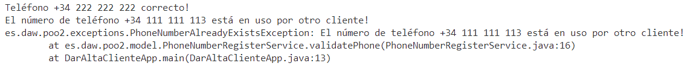

# Ejercicios para trabajar con excepciones propias checked (comprobadas)

## Ejercicio 1: PhoneNumberAlreadyExistsException 

### Versión 1
1. Descarga los fuente iniciales
2. Crea la excepción PhoneNumberAlreadyExistsException en el paquete es.daw.poo2.exceptions.
3. En el método **validatePhone** de la clase PhoneNumberRegisterService implementa el código para comprobar si el número existe en la lista de números proporcionados. Observa cómo se crea el List.
**PISTA:** método contains...

4. Cuando dicha lista contenga el número recibido como argumento, debe crear, lanzar y propagar la excepción con el mensaje "El número de teléfono XXXXX está en uso por otro cliente!"
5. En la clase principal haz la prueba con varios números de teléfono, uno que no esté repetido y otro que lo esté ("+34 222 222 222", "+34 111 111 113") 

Deberás obtener algo similar a esto:



### Versión 2: trabajando con objetos cliente
Vamos a ampliar el ejercicio anterior.

Para ello vamos a crear la **clase Client** (es.daw.poo2.model) en base al siguiente **ClientDAO** que debes crear en el paquete es.daw.poo.dao:

```
package es.daw.poo2.dao;

import java.time.LocalDate;
import java.util.ArrayList;

import es.daw.poo2.model.Client;

public class ClientDAO {
    private ArrayList<Client> clients;

    public ClientDAO() {
        clients = new ArrayList<>();
        clients.add(new Client("2A", "Cliente2", "+34 111 111 112",LocalDate.parse("2024-02-28")));
        clients.add(new Client("1A", "Cliente1", LocalDate.parse("2024-02-27")));
        clients.add(new Client("3A", "Cliente3", "+34 111 111 113",LocalDate.parse("2024-02-29")));
        clients.add(new Client("4B", "Cliente4", "+34 111 111 114",LocalDate.parse("2024-02-29")));
    }

    public ArrayList<Client> select(){
        //return (ArrayList<Cliente>)clientes.clone();
        return new ArrayList<>(clients);
    }
    
}

```

Debes tener en cuenta que para dar de alta un cliente se puede hacer de dos formas:
- Con el código, nombre, número de teléfono y fecha de registro.
- Con el código, nombre y fecha de registro

En el caso de que un cliente se de de alta sin número de teléfono deberá indicarse "WITHOUT_PHONE" en dicho atributo.

Solo el número de teléfono podrá modificarse una vez creado el cliente en el sistema.

En el método **validatePhone** de la clase PhoneNumberRegisterService implementa el código para comprobar si el número existe un cliente con un teléfono en cuestión. La firma del método será:

```
public void validatePhone(ArrayList<Client> clients, String phoneNumber) throws PhoneNumberAlreadyExistsException
```

**Observa las siguiente salida por consola:**


### Versión 3: con método natural de ordenación

Vamos a añadir el método natural de ordenación por fecha de registro.

El resultado tras la ordenación sería:


### Versión 4: encontrar un cliente

Vamos a añadir el siguiente código en la clase principal:

```
        // Simulamos buscar un cliente por el código 1A que ya existe
        Client client2Find = new Client("1A");
        System.out.println("¿Existe el cliente con código 1A?");

        // if (clients.contains(client2Find))
        //     System.out.println("Cliente encontrado");
        // else
        //     System.out.println("Cliente no encontrado");

        System.out.println((clients.contains(client2Find))?"Cliente encontrado":"Cliente no encontrado");

```

El resultado obtenido es el siguiente:


**¿Por qué crees que no lo encuentra cuando el cliente con código 1A existe en la lista?**

Te toca solucionarlo...


