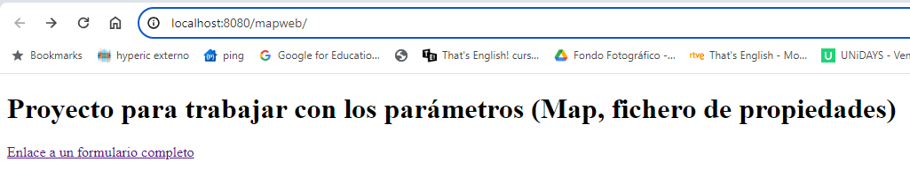
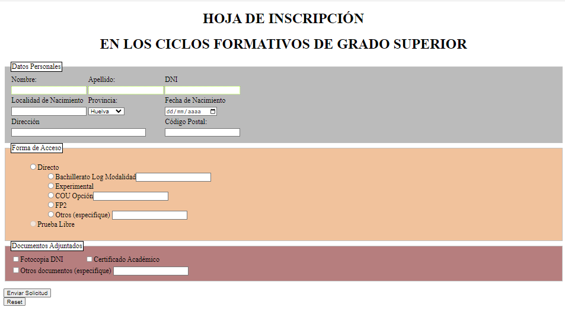
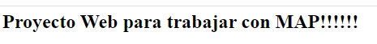
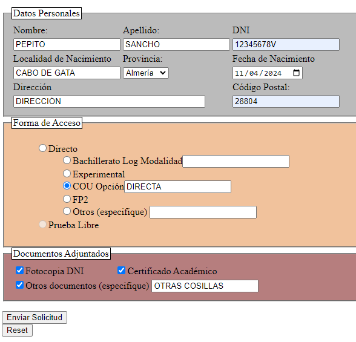

# Proyecto WEB para trabajar con la colección MAP

## FASE I: Pasos

### Teoría y ejemplos asociados

Teoría:

https://aulavirtual3.educa.madrid.org/ies.alonsodeavellan.alcala/mod/book/view.php?id=122109&chapterid=27021

Ejemplos: 

https://github.com/profeMelola/Programacion-06-2023-24/tree/main/EJEMPLOS/Ejemplos_List_Set_Map/map

### Pasos para montar y desplegar el proyecto

1. Descarga la carpeta del proyecto inicial "mapweb"
2. Abre el proyecto con Visual Studio Code
3. Con Maven, crea el paquete WAR
4. Añade dicho paquete a Tomcat (opción Add Deployment)
5. Visualiza tu proyecto en el navegador (Server Actions/Show in Browser)

### Lo que debes obtener



Muestra el formulario:



Envía la solicitud y el servlet te responderá:



___

## FASE II: aprendiendo a recoger los parámetros con MAP

Como práctica guiada, en clase aprenderás a recoger todos los datos del formulario en un MAP.



Veremos distintas formas de recorrer y pintar el contenido de un MAP.

Mostraremos esos datos por la consola de nuestro servidor.

```
* PRIMERA FORMA con keySet():
nombre [PEPITO] 
apellidos [SANCHO] 
dni [12345678V] 
localidad [CABO DE GATA] 
provincia [Almería] 
fecha [2024-04-11] 
direccion [DIRECCIÓN ] 
codpostal [28804] 
etapa [cou] 
opcionCOU [DIRECTA] 
otros [] 
docs [dni, certificado, otros] 
otrosDocs [OTRAS COSILLAS] 

* SEGUNDA FORMA (entrySet()):
KEY:nombre
VALUE:PEPITO
KEY:apellidos
VALUE:SANCHO
KEY:dni
VALUE:12345678V
KEY:localidad
VALUE:CABO DE GATA
KEY:provincia
VALUE:Almería
KEY:fecha
VALUE:2024-04-11
KEY:direccion
VALUE:DIRECCIÓN 
KEY:codpostal
VALUE:28804
KEY:etapa
VALUE:cou
KEY:opcionCOU
VALUE:DIRECTA
KEY:otros
VALUE:
KEY:docs
VALUE:dni
VALUE:certificado
VALUE:otros
KEY:otrosDocs
VALUE:OTRAS COSILLAS

```

