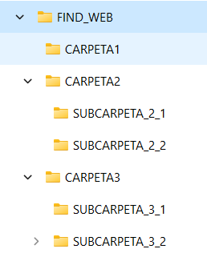
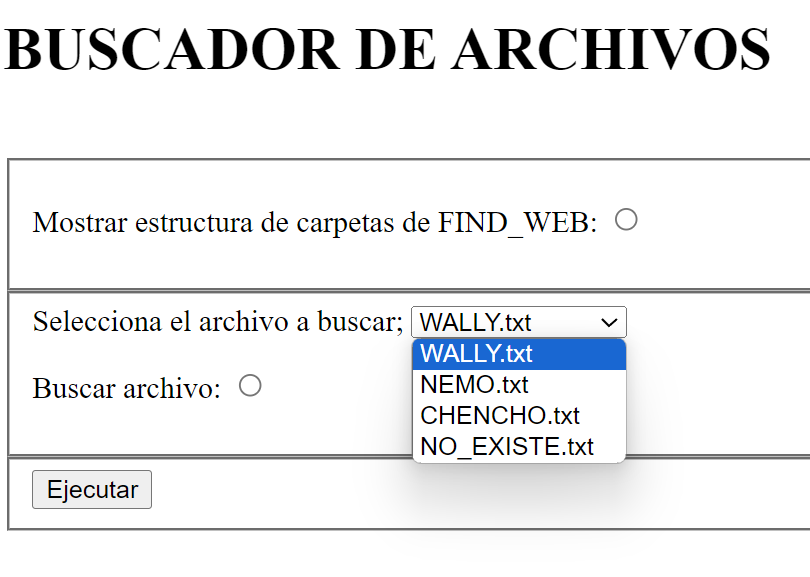
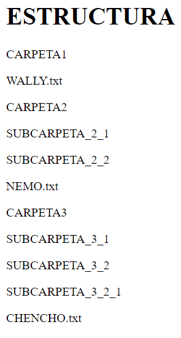

# FIND WEB: BUSCANDO A WALLY

## Vas a crear un proyecto web 

Dicho proyecto hará dos cosas:
- Mostrar la estructura de carpetas y archivos.
- Encontrar un archivo en una estructura de directorios.

Te darás cuenta que la mejor forma de implementar estas funciones es mediante recursividad.

Empieza por la opción 1.1. que es más fácil.

**Crear fichero de log**

Además debes crear en la $user.home/FIND_WEB un archivo de texto llamado **FIND_WEB.log** que contenga una línea por cada directorio o fichero de esa estructura de carpetas:

## Descarga el zip y monta la estructura de carpetas en el directorio home del usuario

Dentro de esta estructura hay ocultos tres archivos llamados:
- WALLY.txt
- NEMO.txt
- CHENCHO.txt

## En la página index.html contendrá un formulario para permitir al usuario elegir la acción a realizar

## Dicho Servlet devolverá una página HTML dependiendo de la acción elegida:

### Mostrar estructura de carpetas:

**Versión mejorada usando la etiqueta HTML details (https://developer.mozilla.org/es/docs/Web/HTML/Element/details)!!!!**

### Buscar archivo:

