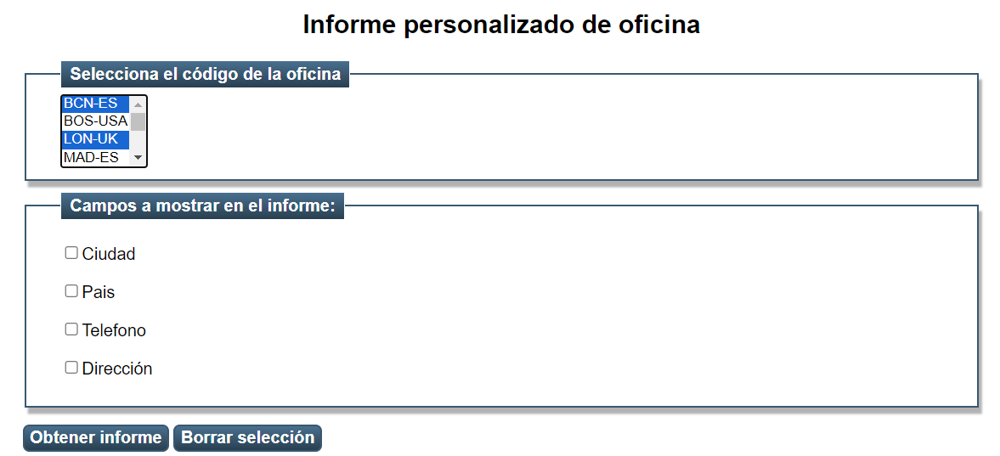
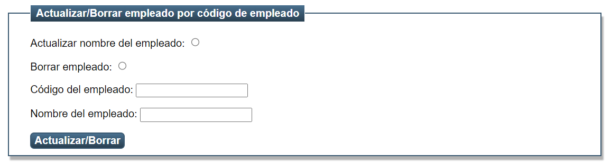

# Refuerzo y ampliación

Usando las dos bases de datos con las que hemos trabajado en clase, vas a ampliar/modificar dichos proyectos.

## Tienda

Actualiza **index.html** en tu proyecto.

Verás que hay una **nueva sección para obtener el listado de productos dependiendo del fabricante.**

Aparece una lista multiselección.

Implementa el código necesario en un nuevo Servlet llamado **Dao3Servlet**

Como resultado debe mostrarse:
- Una única tabla con el resultado de todos los productos de los fabricantes seleccionados.
- Diferentes tablas de productos, una por fabricante.

  
## Oficina

Puedes modificar la lista de oficinas para que sea multiselección y aparezcan tantos informes como oficinas se hayan seleccionado.

___

Además, para reforzar las operaciones CRUD con JDBC, crea otro servlet **Servlet4** encargado de operaciones de:
- Actualización.
- Borrado.

Mejora el código comprobando que el código del empleado exista. Si no es así que se devuelva un mensaje de error en la página html resultado.

___
Actualiza **index.html** en tu proyecto.
